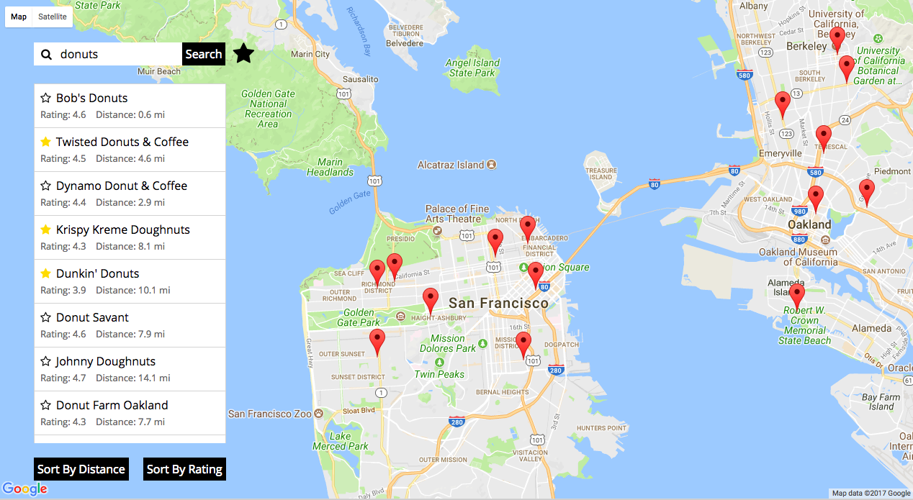

# FindLocations

[FindLocations live][GitHubPages]

[GitHubPages]: https://aravi3.github.io/FindLocations/

FindLocations is a single page web mapping application developed using React.js and the Google Maps API.



## Features & Implementation

### Search for Locations

Users can search for locations using the query box. The Places Library for Google Maps then brings back a list of locations based on the query string. Markers are also placed on the map for the locations in the list:

```js
for (let i = 0; i < results.length; i++) {
  result = {
    place_id: results[i].place_id,
    name: results[i].name,
    rating: results[i].rating,
    latitude: results[i].geometry.location.lat(),
    longitude: results[i].geometry.location.lng()
  };

  locations[results[i].place_id] = result;

  marker = new google.maps.Marker({
    position: {lat: result.latitude, lng: result.longitude},
    map: this.state.map,
    title: result.place_id
  });

  markers.push(marker);
}
```

### Favorite Locations

Users can star locations that they like. When they wish to view a list of their favorites, they can click on the star to the right of the search button. Markers are also placed on the map for the favorite locations.

This is the main logic that executes when a user clicks the star on a location:

```js
if (isFavorite) {
  const placeId = favorites[e.target.dataset.id].place_id;

  delete favorites[e.target.dataset.id];

  if (this.state.onFavorites) {
    this.setState({ locations: favorites });

    this.state.markers.filter((marker) => {
      return marker.title === placeId;
    })[0].setMap(null);
  }
}
else {
  favorites[e.target.dataset.id] = {
    place_id: this.state.locations[e.target.dataset.id].place_id,
    name: this.state.locations[e.target.dataset.id].name,
    rating: this.state.locations[e.target.dataset.id].rating,
    latitude: this.state.locations[e.target.dataset.id].latitude,
    longitude: this.state.locations[e.target.dataset.id].longitude
  };
}
```

### Local Storage

Since no server-side code was used to build this application, I took advantage of `localStorage` to persist data locally. Whenever the user takes an action such as marking their current coordinates, making a new query, favoriting a location, or navigating to the favorites tab, I set this new data item in `localStorage`. Therefore, when the user refreshes the page or initiates a new browser session, they will be able to see the exact same page and state that they left the application in. I chose to use `localStorage` over `sessionStorage` because the former persists data across browser sessions, whereas the latter does not.

For instance, this is how I set the `latitude` and `longitude` items when the user's current coordinates are obtained:

```js
localStorage.setItem("latitude", currentCoordinates.lat.toString());
localStorage.setItem("longitude", currentCoordinates.lng.toString());
```

Then, on initialization of the component, I check whether something exists in localStorage for each item. If something does not exist, then I set the value to undefined:

```js
latitude: parseFloat(localStorage.getItem("latitude")) || undefined,
longitude: parseFloat(localStorage.getItem("longitude")) || undefined
```

### Rank Locations by Distance or Rating

Users can sort the current list of locations by either distance or rating. Distance is sorted from lowest to highest whereas ranking is sorted from highest to lowest. Distance was calculated using the Haversine formula, which determines the distance between two coordinates (coordinates of location and current coordinates) on a sphere:

```js
calculateHaversineDistance(lat1, lng1, lat2, lng2) {
  const earthRadiusMiles = 3959;
  const dLat = this.degreesToRadians(lat2 - lat1);
  const dLon = this.degreesToRadians(lng2 - lng1);
  const a =
    Math.sin(dLat/2) * Math.sin(dLat/2) +
    Math.cos(this.degreesToRadians(lat1)) * Math.cos(this.degreesToRadians(lat2)) *
    Math.sin(dLon/2) * Math.sin(dLon/2)
    ;
  const c = 2 * Math.atan2(Math.sqrt(a), Math.sqrt(1 - a));
  const distance = earthRadiusMiles * c;

  return distance.toFixed(1);
}
```

### Error Handling

If the Google Maps API is not able to successfully return results for whatever reason, the relevant error is displayed on the screen:

```js
case "ERROR":
  error.push("There was a problem contacting the Google servers");
  break;
case "INVALID_REQUEST":
  error.push("Invalid request");
  break;
case "OVER_QUERY_LIMIT":
  error.push("Request quota exceeded");
  break;
case "REQUEST_DENIED":
  error.push("This webpage is not allowed to use the PlacesService");
  break;
case "UNKNOWN_ERROR":
  error.push("Request could not be processed due to a server error");
  break;
case "ZERO_RESULTS":
  error.push("No results were found for this request");
  break;
```

### Autocomplete

I also implemented the autocomplete feature for the query box. Autocomplete is a feature of the Places Library:

```js
setAutocomplete(e) {
  e.preventDefault();
  const options = {};
  const autocomplete = new google.maps.places.Autocomplete(e.target, options);
}
```
